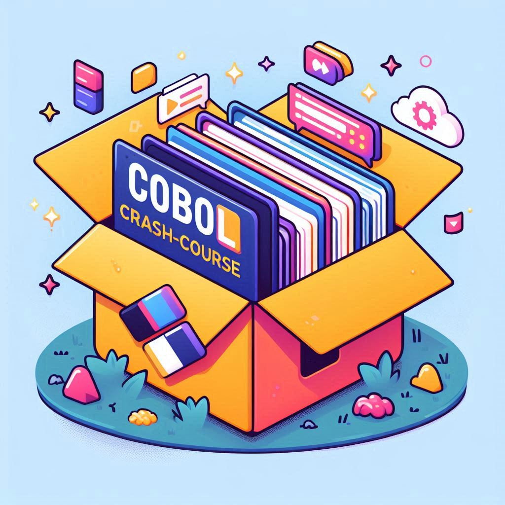

# COBOL Learning Resources

<p align="center">
  
</p>

COBOL (Common Business-Oriented Language) is a high-level programming language used primarily for business, finance, and administrative systems. It was developed in the late 1950s and is still in use today in many legacy systems.

This repository contains various resources for learning COBOL, including lectures, examples, and tools.

## Directory Structure

Hands-on Exercises: Include hands-on exercises and coding challenges in

- **docs/**: Contains documentation and lecture notes.
  - **lectures/**: Lecture notes for different topics.
    - [Lecture 01: Introduction to COBOL](docs/lectures/lecture-01-intro-to-cobol.md)
    - [Lecture 02: COBOL Basics](docs/lectures/lecture-02-cobol-basics.md)
    - [Lecture 03: Data Types and Variables](docs/lectures/lecture-03-data-types-and-variables.md)
    - [Lecture 04: Conditional Statements](docs/lectures/lecture-04-conditional-statements.md)
    - [Lecture 05: Loops and Iteration](docs/lectures/lecture-05-loops-and-iteration.md)
    - [Lecture 06: Arrays and Tables](docs/lectures/lecture-06-arrays-and-tables.md)
    - [Lecture 07: Subprograms and Functions](docs/lectures/lecture-07-subprograms-and-functions.md)
    - [Lecture 08: File Handling in COBOL](docs/lectures/lecture-08-file-handling.md)
    - [Lecture 09: Error Handling and Debugging](docs/lectures/lecture-09-error-handling-and-debugging.md)
    - [Lecture 10: Advanced Topics in COBOL](docs/lectures/lecture-10-advanced-topics.md)
    <!-- - [Lecture 11: Object-Oriented COBOL](docs/lectures/lecture-11-object-oriented-cobol.md)
    - [Lecture 12: COBOL in Modern Environments](docs/lectures/lecture-12-cobol-in-modern-environments.md)
    - [Lecture 13: Building an Inventory Management System](docs/lectures/lecture-13-inventory-management-system.md)
    - [Lecture 14: Developing a Payroll System](docs/lectures/lecture-14-payroll-system.md)
    - [Lecture 15: Creating a CRM System](docs/lectures/lecture-15-crm-system.md) -->
  - **notes/**: Additional notes and references.
  - **slides/**: Presentation slides for lectures.

- **examples/**: Contains example COBOL programs.
  - [hello-world.cbl](examples/hello-world.cbl): A simple "Hello, World!" program in COBOL.

- **resources/**: Additional resources for learning COBOL.

- **tools/**: Tools and scripts for working with COBOL.
  - **cobol-compiler/**: Scripts for compiling COBOL programs.
    - [build-cobol-binary.sh](tools/cobol-compiler/build-cobol-binary.sh): Script to build COBOL binaries.

## Getting Started

To get started with COBOL, you can begin by reading the lecture notes in the `docs/lectures/` directory. The first lecture provides an introduction to COBOL, its history, and its key features.

### Running the Hello World Example

1. Navigate to the `examples/` directory:

    ```sh
    cd examples
    ```

2. Compile the `hello-world.cbl` program using the COBOL compiler script:

    ```sh
    ../tools/cobol-compiler/build-cobol-binary.sh hello-world.cbl
    ```

3. Run the compiled binary:

    ```sh
    ./hello-world
    ```

You should see the output:
  
Hello, World!

## Contributing

If you would like to contribute to this repository, feel free to submit a pull request with your changes. You can contribute by adding new lectures, examples, tools, or resources related to COBOL.

## License

This repository is licensed under the MIT License. See the [LICENSE](LICENSE) file for more details.

## Acknowledgements

This repository was created by [Andres Caicedo](https://github.com/AndresCdo) as part of a series of lectures on COBOL programming.
